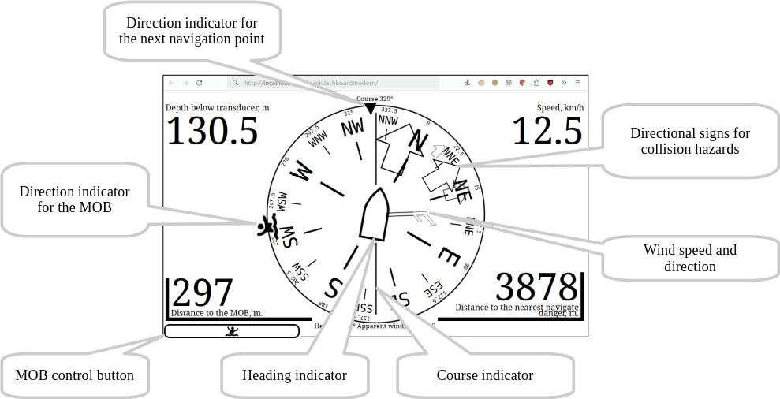

[По русски](README.ru-RU.md)  
# E-InkDashboardModern SignalK Edition 
 Web application that shows in the browser the main parameters of the ship's movement received from the [SignalK](https://signalk.org/) server.  
 The application is aimed at mobile devices with e-ink screen and does not require installation of any applications: the existing browser is sufficient.  
 Of course, the app also works in any more or less modern browser on any device with any screen size.

**WARNING! No information shown or not shown by this application may serve as a basis for an action or inaction of the shipmaster.**

## v. 0.2
Contents:  
- [Features](#features)
- - [Direction](#direction)
- - [Wind](#wind)
- - [Navigation](#navigation)
- - [Collision alarm](#collision-alarm)
- - [Man Overboard](#man-overboard)
- - [In screen corners](#in-screen-corners)
- - [Data actuality](#data-actuality)
- [Requirements](#requirements)
- [Dependencies](#dependencies)
- [Installation](#installation)
- [Launch](#launch)
- [Support](#support)

## Features
If data are available, the following directions and values may be shown:

  
### Direction
One of the following values can be selected as the direction in the application configuration:

* Course over ground
* Course over ground magnetic
* Heading true
* Heading magnetic
* Heading compass

The Course over ground is default value because this is commonly reported by the GPS receiver.

If Course is selected as the direction, the course indicator remains vertical and, when heading information is available, the schematic representation of the ship in the centre is rotated by the drift angle to indicate the heading. If Heading is selected as the direction, the heading indicator remains vertical and the course indicator is rotated by the drift angle, as shown in the illustration below.  
If there is only one of the values: course or heading, the direction of the both indicators remains vertical.  
Which value is selected as the direction is indicated below the top edge of the screen, and which value will be rotated is indicated above the bottom edge.

### Wind
If wind speed and wind direction information is available, a wind indicator will be displayed. The symbols of the pointer corresponds to that used in meteorology: a short stroke means a wind speed of 2.5 m/sec, a long stroke means 5 m/sec, and a triangle means 25 m/sec. Thus, the illustration shows wind speeds greater than or equal to 7.5 but less than 10 m/sec.  
For your reference, the exact wind speed is indicated above the bottom edge of the screen.

One of the following values may be specified as the wind:

* Apparent wind
* True wind through water
* True wind through ground
* Wind direction true
* Wind direction magnetic
* none

The default value is the Apparent wind.

### Navigation
If there is information about the next navigation point, a direction indicator to that point will be displayed. If specified in the application configuration - the distance to a point will be displayed in one corner of the screen.  
The next navigation point will be displayed in any route mode, both when following the specified point and when following the route.

### Collision alarm
Using this feature requires installation of the SignalK [collision-detector](https://www.npmjs.com/package/collision-detector) extension. The extension is installed in the usual way from the Appstore in the SignalK Administrative Interface.

Pointers in the form of contour arrows indicate directions to hazards issued by the collision-detector extension. The largest arrow shows the direction of the nearest hazard, with the distance to the hazard displayed in the lower right corner of the screen (regardless of what was previously shown there). This value is framed by a flashing corner frame to attract attention.  
Once the hazard is gone, the information in the lower right corner is restored.

### Man Overboard
The "Man Overboard" mode raise by  pressing the key in the lower left corner. A message is sent to the SignalK server, which can be picked up by relevant programmes, and the [GaladrielMap](https://www.npmjs.com/package/galadrielmap_sk) and Freeboard-SK chartplotters displays the location of the object.  
The direction to the object is shown, and the distance is also shown in the lower left corner, regardless of what has been shown at that location before. The distance is framed by a flashing corner frame to attract attention.  
The information in the lower left corner is restored when the "Man Overboard" situation is canceled.

You can cancel the "Man overboard" mode by pressing the key in the lower left corner again. In the panel that opens, select Cancel. You can also stop the "Man overboard" mode by using the corresponding tools in the [GaladrielMap](https://www.npmjs.com/package/galadrielmap_sk) or Freeboard-SK chartploters.  
If necessary, using the same panel, you can add more points related to the "Man overboard" situation. They will be shown in the chartplotter [GaladrielMap](https://www.npmjs.com/package/galadrielmap_sk ) and can be processed there.

When using [naiveGPXlogger](https://www.npmjs.com/package/naivegpxlogger) it is recommended to enable the "Start logging by the MOB alarm" option. Then, when activating the "Man overboard" mode, the logging of the path will begin, and the recorded path will automatically be shown in the chartploter [GaladrielMap](https://www.npmjs.com/package/galadrielmap_sk).

### In screen corners
One of the following values may be displayed in each of the four corners of the screen, if the SignalK server has the information:

* Speed ower ground
* Speed through water
* Depth below surface
* Depth below keel
* Depth below transducer
* Engine 1 revolutions
* Engine 1 temperature
* Engine 2 revolutions
* Engine 2 temperature
* Outside air temperature
* Outside air pressure
* Outside air relative humidity
* Water temperature
* Next navigated point
* none

What exactly to show in each corner is determined in the application settings in the SignalK Administrative Interface.

A tap in the corner of the screen enlarges the display of the corresponding value. This can be useful for temporarily improving the readability of specific data in special situations.  
  
Tapping again returns the displaying to its normal size.

### Data actuality
The application keeps track of the actuality of the incoming data. If the incoming information is older than a certain period of time (different for each value), its display is stopped. When the current information is resumed, the display is resumed as well.

## Requirements
The web application requires a more or less modern browser (version not older than 5 years), and will not work in Internet Explorer browser. Some device performance and sufficient e-ink screen refresh rate are also required. However, all modern e-book type devices have the required features.

## Dependencies
Collision alerting requires the [collision-detector](https://www.npmjs.com/package/collision-detector) extension to be installed in SignalK.  
The use of a [GaladrielMap](https://www.npmjs.com/package/galadrielmap_sk) chartplotter is highly recommended for Man Overboard notification.

## Installation
e-inkdashboardmodern is a SignalK web application (Webapps), and can be installed in the SignalK environment in the usual way from the Appstore in the SignalK Administrative Interface.

## Launch
In the SignalK Administration Interface, select Webapps -> E-InkDashboardModern SignalK Edition  
  

## Support
[Discussions](https://github.com/VladimirKalachikhin/Galadriel-map/discussions)

The forum will be more lively if you make a donation at [ЮMoney](https://sobe.ru/na/galadrielmap)

[Paid personal consulting](https://kwork.ru/it-support/20093939/galadrielmap-installation-configuration-and-usage-consulting)  

If you think the app should support nautical units of measurement - make a donation marked "For Nautical Units". If enough money is raised, the author will make an endorsement.  
If you really need marine units of measurement - make a substantial donation and the author will make a support specifically for you.

