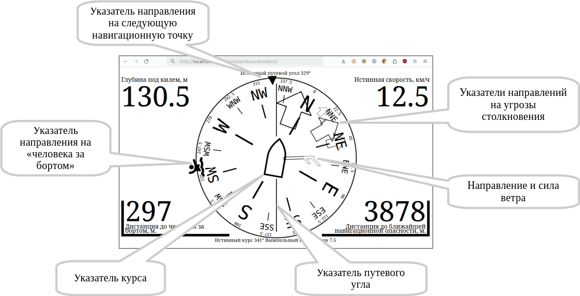
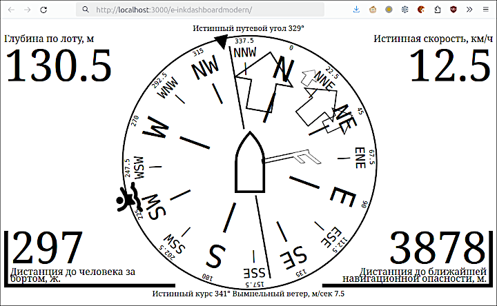
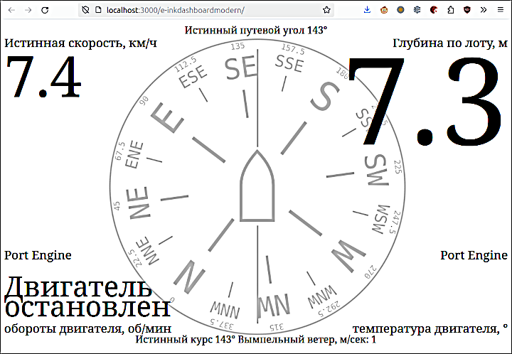

[In English](README.md)  
# E-InkDashboardModern SignalK Edition 
Веб-приложение, показывающее в браузере основные параметры движения судна, получаемые от сервера [SignalK](https://signalk.org/).  
Приложение ориентировано на мобильные устройства с e-ink экраном (на "электронных чернилах") и не требует установки каких-либо приложений: достаточно имеющегося браузера.  
Разумеется, приложение работает также в любом более-менее современном браузере на любом устройстве с любым размером экрана.

**Внимание! Никакая информация, показываемая или не показываемая этим приложением, не может служить основанием для действия или бездействия судоводителя.**   

## v. 0.0
Оглавление:  
- [Возможности](#возможности)
- - [Направление движения](#направление-движения)
- - [Ветер](#ветер)
- - [Навигация](#навигация)
- - [Угроза столкновения](#угроза-столкновения)
- - ["Человек за бортом"](#человек-за-бортом)
- - [В углах экрана](#в-углах-экрана)
- - [Актуальность данных](#актуальность-данных)
- [Требования](#требования)
- [Зависимости](#зависимости)
- [Установка](#установка)
- [Запуск](#запуск)
- [Поддержка](#поддержка)

## Возможности
При наличии данных могут быть показаны следующие направления и величины:  

  
### Направление движения
За направление в конфигурации приложения может быть выбрана одна из следующих величин:  

* Course over ground (COG) - истинный путевой угол
* Course over ground magnetic (CGM) - магнитный путевой угол
* Heading true (HT) - истинный курс
* Heading magnetic (HM) - исправленный магнитный курс
* Heading compass (HC) - магнитный курс

По умолчанию выбирается истинный путевой угол, потому что именно эту величину сообщает приёмник ГПС.

Если в качестве направления выбирается путевой угол, то указатель направления движения остаётся вертикальным, а при наличии информации о курсе схематическое изображение кораблика в центре поворачивается на угол дрейфа и указывает курс. Если же в качестве направления выбирается курс, то указатель курса остаётся вертикальным, а на угол дрейфа поворачивается указатель путевого угла, как это показано на иллюстрации ниже.  
Если есть только одна из величин: путевой угол или курс, то направление указателей остаётся вертикальным.  
Какая величина выбрана в качестве направления указывается под верхним обрезом экрана, а какая будет поворачиваться - над нижним.

### Ветер
При наличии информации о скорости и направлении ветра будет показываться указатель ветра. Символика указателя соответствует принятой в метеорологии: короткий штрих означает скорость ветра 2.5 м/сек, длинный - 5 м/сек, а треугольник - 25 м/сек.  
Таким образом, на иллюстрации указана скорость ветра больше или равно 7.5, но меньше 10 м/сек.  
Для справки точная скорость ветра указывается над нижним обрезом экрана.  

В качестве ветра может быть указана одна из следующих величин:

* Apparent wind (AW) - вымпельный ветер
* True wind through water (TWA)	- вычисленный истинный ветер, по скорости по лагу
* True wind (TW) - истинный ветер
* True wind magnetic (TWM) - магнитный истинный ветер
* True wind through ground (GWA) - вычисленный истинный ветер, по истинной скорости
* none - не показывать ветер

Умолчальным значением является вымпельный ветер.

### Навигация
При наличии информации о следующей навигационной точке будет отображён указатель направления на эту точку. Если указано в конфигурации приложения - в одном из углов экрана будет отображаться информация о расстоянии до точки.  
Следующая навигационная точка будет отображаться при любом режиме следования, как при следовании к указанной точке, так и при следовании по маршруту.

### Угроза столкновения
Использование этой возможности требует установки расширения SignalK [collision-detector](https://www.npmjs.com/package/collision-detector). Расширение ставится обычным способом из Appstore в Административном интерфейсе SignalK.  

Указатели в виде контурных стрелок указывают направления на опасности, выдаваемые расширением collision-detector. Самая крупная стрелка показывает направление ближайшей опасности, при этом расстояние до опасности отображается в правом нижнем углу экрана (вне зависимости от того, что там показывалось ранее). Для привлечения внимания эта величина обрамляется мигающей угловой рамкой.  
После исчезновения опасности информация в правом нижнем углу восстанавливается.

### "Человек за бортом"
Показ направления и расстояния до объекта в ситуации "Человек за бортом" возможен по крайней мере в случае, когда режим "Человек за бортом" установлен из картплотера [GaladrielMap](https://www.npmjs.com/package/galadrielmap_sk).  

Показывается направление на объект, кроме того, в левом нижнем углу указывается дистанция, вне зависимости от того, что показывалось на этом месте ранее. Для привлечения внимания дистанция обрамляется мигающей угловой рамкой.  
После прекращения ситуации "Человек за бортом" информация в левом нижнем углу восстанавливается.

### В углах экрана
В каждом из четырёх углов экрана может быть отображена одна из следующих величин, если соответствующая информация есть у сервера SignalK:

* Speed ower ground (SOG) - истинная скорость
* Speed through water (STW) - скорость по лагу
* Depth below surface (DBS) - глубина
* Depth below keel (DBK) - глубина под килем
* Depth below transducer (DBT) - глубина по лоту
* Engine 1 revolutions - обороты двигателя
* Engine 1 temperature - температура двигателя
* Engine 2 revolutions - обороты второго двигателя
* Engine 2 temperature - температура второго двигателя
* Outside air temperature - температура наружного воздуха
* Outside air pressure - атмосферное давление
* Outside air relative humidity - относительная влажность наружного воздуха
* Water temperature - температура воды
* Next navigated point - расстояние до следующей навигационной точки
* none - ничего не показывать

Умолчальными значениями являются:  

- для левого верхнего угла: истинная скорость  
- для правого верхнего угла: глубина по лоту  
- для левого нижнего угла: обороты двигателя  
- для правого нижнего угла: температура двигателя  

Что именно показывать в каждом углу определяется в настройках приложения в Административном интерфейсе SignalK.  

Краткое касание в углу экрана укрупняет отображение соответствующей величины. Это может быть полезно для временного улучшения читаемости конкретных данных в особых ситуациях.  
  
Повторное касание возвращает обычный размер изображения.

### Актуальность данных
Приложение отслеживает актуальность поступающих данных. Если поступающая информация старее определённого срока (своего для каждой величины), её показ прекращается. При возобновлении поступления актуальной информации возобновляется и её показ.

## Требования
Веб-приложение требует более-менее современного браузера (версии не старше 5 лет), и заведомо не работает в браузере Internet Explorer. Требуется также некоторая производительность устройства и достаточная скорость обновления e-ink экрана. Впрочем, все современные устройства типа "электронная книга" обладают требуемыми характеристиками.

## Зависимости
Для оповещения об опасности столкновения требуется, чтобы в SignalK было установлено расширение [collision-detector](https://www.npmjs.com/package/collision-detector).  
Для оповещения о ситуации "Человек за бортом" настоятельно рекомендуется использование картплотера [GaladrielMap](https://www.npmjs.com/package/galadrielmap_sk).

## Установка
e-inkdashboardmodern является веб-приложением (Webapps) SignalK, и может быть установлено в среде SignalK обычным образом из Appstore в Административном интерфейсе SignalK.

## Запуск
В Административном интерфейсе SignalK выбрать Webapps -> E-InkDashboardModern SignalK Edition  
  
или набрать в адресной строке браузера `http://путь-к-SignalK:3000/e-inkdashboardmodern/`

## Поддержка
[Форум](https://github.com/VladimirKalachikhin/Galadriel-map/discussions)

Форум будет живее, если вы сделаете пожертвование на [ЮМани](https://sobe.ru/na/galadrielmap).

Вы можете получить [индивидуальную платную консультацию](https://kwork.ru/training-consulting/20093293/konsultatsii-po-ustanovke-i-ispolzovaniyu-galadrielmap) по вопросам установки и использования [E-InkDashboardModern SignalK Edition]().

Если Вы считаете, что приложение должно поддерживать морские единицы измерения - внесите пожертвование с пометкой "За морские единицы". Если наберётся достаточная сумма - автор сделает поддержку.  
Если Вам очень нужны морские единицы измерения - внесите весомое пожертвование, и автор сделает поддержку специально для Вас.
